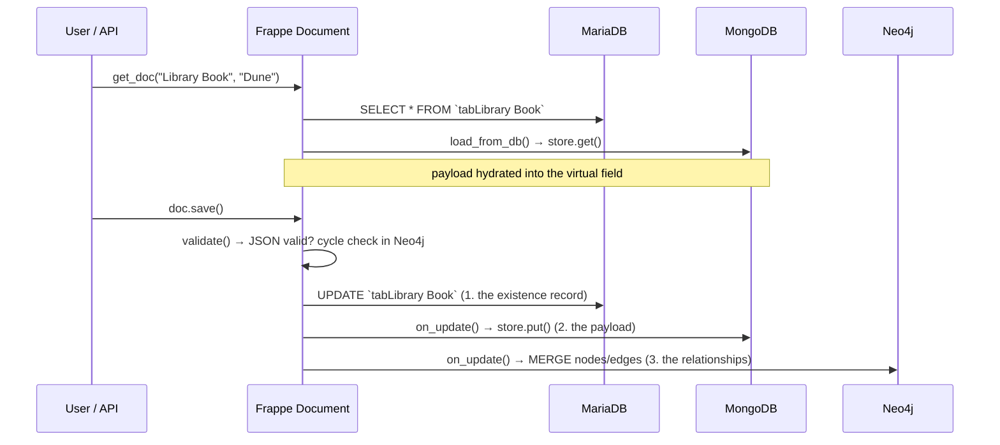
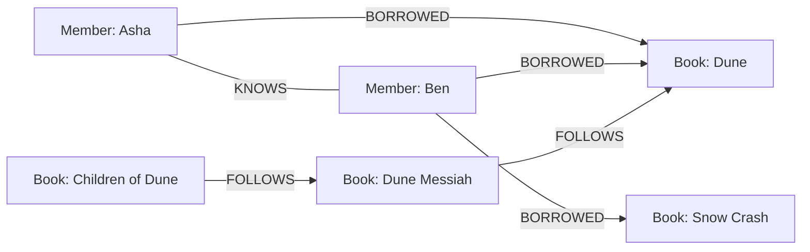

# Developer Guide — running MongoDB and Neo4j next to Frappe's SQL

> **Who this is for:** a developer who has used Frappe a bit, has never wired a
> second database into it, and has to rebuild or extend this app. No prior
> MongoDB or Neo4j experience assumed. Read it top to bottom once; after that
> the section titles are your index.

---

## 1. The two-minute version

Frappe assumes one SQL database. Every DocType is a table, every field is a
column, every query is SQL. That assumption is baked in deep enough that
"just swap the database" is not a weekend job.

But it turns out you don't have to swap anything. **A record doesn't have to
live in one place.** You can slice a single DocType across three engines and
let the controller stitch it back together:

```
Library Book "Dune"
├── MariaDB   title, author, isbn, media_type, status      ← the row that says "this book exists"
├── MongoDB   { pages: 412, series: "Dune", themes: [...] } ← the bits with no fixed shape
└── Neo4j     (Dune)<-[:BORROWED]-(Asha), (Dune Messiah)-[:FOLLOWS]->(Dune)
```

The user sees one form. Frappe sees a normal DocType. Three databases are
doing the work.

Three ideas make it hold together, and the whole app is just these three
ideas plus some UI:

| Idea | Where it lives | One-line summary |
| --- | --- | --- |
| **Adapter** | `polystore/stores/` | A tiny interface — `put`, `get`, `delete`, `find`, `count`, `ping` — that any non-SQL store can satisfy. |
| **Routing** | `polystore/stores/registry.py` | Site config says which DocType goes to which backend. Everything else stays pure SQL. |
| **One traversal module** | `polystore/graph/traversal.py` | The *only* file in the codebase allowed to write Cypher. |

Then a mixin (`polystore/overrides/poly_document.py`) hangs the adapter onto
Frappe's document lifecycle, and that's the app.

---

## 2. Why not just... use JSON columns?

Fair question, and you should ask it before adding a database to anything.

MariaDB has a JSON type. Postgres has `jsonb` with real indexes. For "I need
flexible attributes at moderate write volume", that is genuinely the right
answer and it costs you nothing operationally.

The reason this repo exists anyway is that **it is a proof of mechanism**, not
a recommendation to run three databases. The feasibility notes in this folder
(`Database-Flexibility-in-Frappe.docx`, `Graph-Database-in-Frappe.docx`) argue
for exactly that restraint: prove the routing works, then only route the data
that genuinely needs it.

So read this guide as "here is how the plumbing works if you need it", not
"here is how every Frappe app should be built."

---

## 3. The lifecycle, and where we cut in

This is the single most important diagram in the document. Frappe gives you
hook methods on every Document. We use five of them:



Written out as a table, because you will come back to this:

| Frappe hook | What we do in it | File |
| --- | --- | --- |
| `load_from_db()` | Read the MongoDB payload into the virtual field | `poly_document.py` |
| `onload()` | Ship payload + graph data to the browser via `__onload` | `poly_document.py`, `library_member.py` |
| `validate()` | Parse the JSON; refuse series cycles (asks Neo4j) | `library_book.py` |
| `after_insert()` / `on_update()` | Write MongoDB payload, then Neo4j nodes/edges | both controllers |
| `on_trash()` | Delete the payload and detach the graph node | both controllers |

**Order matters and it is deliberate.** SQL is written by the framework
first — that row is the record that the thing exists. MongoDB and Neo4j are
written after. See §9 for what happens when step 2 fails.

---

## 4. Layer 1 — the adapter contract

`polystore/stores/base.py` is thirty lines of abstract class and it is the
most important design decision in the repo:

```python
class DocumentStore(abc.ABC):
	@abc.abstractmethod
	def put(self, doctype: str, docname: str, payload: dict) -> None: ...
	@abc.abstractmethod
	def get(self, doctype: str, docname: str) -> dict: ...
	@abc.abstractmethod
	def delete(self, doctype: str, docname: str) -> None: ...
	@abc.abstractmethod
	def find(self, doctype: str, criteria: dict, limit: int = 20) -> list[dict]: ...
	@abc.abstractmethod
	def count(self, doctype: str, criteria: dict | None = None) -> int: ...
	@abc.abstractmethod
	def ping(self) -> dict: ...
```

Six methods. That's the whole contract, and it is deliberately modelled on the
narrow slice of `frappe.database.Database` a DocType actually needs.

Two things to notice:

1. **Every method is keyed by `(doctype, docname)`.** The Frappe document name
   is the primary key on both sides, so the SQL row and the Mongo document can
   never disagree about identity. In MongoDB that means `_id` *is* the Frappe
   name:

   ```python
   def put(self, doctype, docname, payload):
       document = dict(payload or {})
       document["_id"] = docname          # ← the join key, for free
       document["doctype"] = doctype
       self._collection(doctype).replace_one({"_id": docname}, document, upsert=True)
   ```

2. **Failures are typed, never silent.** `StoreUnavailable` when the service is
   down, `StoreOperationUnsupported` when an adapter genuinely cannot do
   something. A backend that can't honour an operation says so out loud — it
   does not return an empty list and let you think there was no data.

### Adding a second backend

You never touch the core. Write a class, register it:

```python
from polystore.stores.base import DocumentStore
from polystore.stores.registry import register_adapter

class RedisDocumentStore(DocumentStore):
    name = "redis"
    ...  # implement the six methods

register_adapter("redis", RedisDocumentStore)
```

Then point a DocType at it in site config. Done.

---

## 5. Layer 2 — routing is configuration, not code

`polystore/stores/registry.py`:

```python
def routing_table() -> dict[str, str]:
	return frappe.conf.get("polystore_routing") or {}

def store_for(doctype: str) -> DocumentStore | None:
	backend = routing_table().get(doctype)
	if not backend:
		return None            # ← not routed = ordinary Frappe, untouched
	...
```

In `sites/polystore.localhost/site_config.json`:

```json
"polystore_routing": {
  "Library Book": "mongo",
  "Library Member": "mongo"
}
```

`Book Loan` is **not** in that map, and that is the point — it behaves like any
other DocType in any other Frappe app. The blast radius of this whole app is
exactly the DocTypes you opt in.

> **Why config and not a decorator or a hook?** Because the person deciding
> which data needs a different store is usually not the person deploying it.
> Config means you can route a DocType on one site and not another without a
> code change. It also means `bench --site x set-config` is your entire
> migration path.

---

## 6. Layer 3 — the mixin that makes it feel native

`polystore/overrides/poly_document.py`. A DocType opts in by inheriting:

```python
class LibraryBook(PolyStoreMixin, Document):
    ...
```

`PolyStoreMixin` comes **first** in the MRO so its lifecycle methods win. It
gives the document five abilities:

```python
def load_payload(self)  -> dict   # read from the store
def save_payload(self)  -> None   # write to the store (throws loudly on failure)
def drop_payload(self)  -> None   # delete from the store
def parsed_payload(self)-> dict   # the virtual field's text, parsed + validated
def apply_payload(self) -> None   # store → virtual field (for display)
```

and wires two of them into Frappe automatically:

```python
def load_from_db(self) -> None:
	"""Populate the virtual field on every read, not just in the form."""
	super().load_from_db()
	self.apply_payload()
```

That four-line method is the difference between working and quietly losing
data. See gotcha **G4** below — we shipped the bug before we shipped the fix,
and the symptom was books silently losing their attributes.

---

## 7. The virtual field, and the three lies it tells you

The flexible payload is exposed to the desk as a field named
`attributes_json` with `"is_virtual": 1`. Virtual means **Frappe creates no
column for it** — which is precisely what we want, and also the source of every
UI bug we hit. Three of them, in the order we tripped over them:

### Lie 1 — "`options` is just the syntax highlighting language"

For a normal `Code` field, `options: "JSON"` picks the editor mode. For a
**virtual** field, Frappe treats `options` as a *Python expression to evaluate*
in order to compute the field's value. So this:

```json
{"fieldname": "attributes_json", "fieldtype": "Code", "options": "JSON", "is_virtual": 1}
```

...blew up on every save with:

```
NameError: name 'JSON' is not defined
```

**Rule: on a virtual DocField, leave `options` empty** unless you actually want
an expression there.

### Lie 2 — "the value is on the document, so the browser has it"

`Document.get_valid_dict()` strips virtual fields — that's how they avoid the
database. But the REST response is built from that same dict, so the *browser*
never sees the value either. The form showed a blank box even though the server
had the data.

Fix: send it out of band, in `onload`:

```python
def onload(self) -> None:
	self.set_onload("polystore_payload", self.get(PAYLOAD_FIELD) or "")
```

and pick it up client-side:

```javascript
const stored = (frm.doc.__onload || {}).polystore_payload;
if (!frm.doc.attributes_json) {
    frm.doc.attributes_json = stored || "{}";
}
frm.refresh_field("attributes_json");
```

### Lie 3 — "a visible field is an editable field"

In `base_control.js`, Frappe forces `is_virtual` fields to display status
`Read`, and hides read-only fields whose value is null. Net effect on a new
record: **the box doesn't render at all.** Two fixes, both needed:

* always give the field a value (`"{}"` when empty) so it renders;
* since the user can't type into it, add an **Edit Attributes** button
  (a `Button` DocField, which *does* render on unsaved documents, unlike toolbar
  buttons) that opens a dialog and writes through an API:

```python
@frappe.whitelist()
def save_attributes(book: str, payload: str) -> dict:
	frappe.has_permission("Library Book", ptype="write", doc=book, throw=True)
	document = frappe.get_doc("Library Book", book)
	document.set("attributes_json", payload)
	parsed = document.parsed_payload()          # validates, throws on bad JSON
	store_for("Library Book").put("Library Book", book, parsed)
	return parsed
```

This turned out to be a *better* design than an editable field, because it is
honest: the form can only display this data; writing it goes straight to
MongoDB. That's a good line to say out loud in a demo.

> On an **unsaved** document there is nothing to write to yet, so the dialog
> just sets the value locally and lets it ride along with the insert —
> `after_insert()` then calls `save_payload()`.

---

## 8. Layer 4 — the graph, behind one door

Everything Neo4j is reached through `polystore/graph/`, which is two files:

* **`backend.py`** — the only module that imports the `neo4j` driver. It builds
  a cached driver from site config, exposes `run(cypher, params)` and `ping()`,
  and converts every driver exception into one `GraphUnavailable`.
* **`traversal.py`** — the API the rest of the app is allowed to call. **No
  Cypher is written anywhere else in the codebase.**

That boundary is the entire recommendation of the graph feasibility note: if
you later decide Neo4j was overkill and a recursive CTE in Postgres is enough,
you rewrite one module instead of auditing the app.

### The data model

Two node labels, three relationship types. That's it:



* `BORROWED` — written when a Book Loan is saved. **It survives the return**,
  because borrowing history is what makes recommendations possible.
* `FOLLOWS` — the series order, from the `follows` Link field on Library Book.
* `KNOWS` — reader-to-reader links. These have **no SQL row and no child
  table at all**; they exist only as Neo4j edges. Best demo of the three.

### The three primitives

The graph feasibility note asked for exactly three operations, and everything
else is built on them:

**1. Direct edges** — one hop:

```python
def connections(member: str) -> list[dict]:
	return run("""
		MATCH (:Member {name: $member})-[:KNOWS]-(other:Member)
		RETURN other.name AS name, other.member_name AS member_name,
		       other.membership_type AS membership_type
		ORDER BY member_name
	""", {"member": member})
```

**2. Transitive closure, with a depth cap** — `*1..6`, never unbounded:

```python
MAX_DEPTH = 6

def series_chain(book: str, depth: int = MAX_DEPTH) -> list[dict]:
	depth = max(1, min(int(depth), MAX_DEPTH))       # cap, always
	return run(f"""
		MATCH path = (b:Book {{name: $book}})-[:FOLLOWS*1..{depth}]->(ancestor:Book)
		RETURN ancestor.name AS name, ancestor.title AS title, length(path) AS distance
		ORDER BY distance
	""", {"book": book})
```

> Note the `f`-string only interpolates the **depth**, which we clamped to an
> int a line earlier. Everything user-supplied goes through `$parameters`.
> Neo4j does not accept a parameter in the variable-length pattern, which is
> why the cap has to be enforced in Python — don't "simplify" this later.

**3. Cycle detection** — before writing an edge, ask whether the reverse path
already exists:

```python
def would_create_cycle(book: str, follows: str) -> list[str]:
	if book == follows:
		return [book]
	rows = run(f"""
		MATCH path = (start:Book {{name: $follows}})-[:FOLLOWS*1..{MAX_DEPTH}]->(end:Book {{name: $book}})
		RETURN [node IN nodes(path) | node.title] AS titles
		LIMIT 1
	""", {"book": book, "follows": follows})
	return rows[0]["titles"] if rows else []
```

and in the controller's `validate()`:

```python
path = traversal.would_create_cycle(self.name, self.follows)
if path:
	frappe.throw(
		_("This would create a loop in the series: {0}").format(" -> ".join(path + [self.title])),
		title=_("Cycle in series"),
	)
```

The error **names the offending path** — "Dune -> Dune Messiah -> Children of
Dune" — instead of saying "invalid". That is the difference between an error
message and a support ticket.

### The two queries people actually came for

Recommendations, in one traversal that would be three joins and a
self-referencing subquery in SQL:

```cypher
MATCH (me:Member {name: $member})-[:BORROWED]->(:Book)<-[:BORROWED]-(peer:Member)
MATCH (peer)-[:BORROWED]->(suggestion:Book)
WHERE NOT (me)-[:BORROWED]->(suggestion)
RETURN suggestion.title AS title, count(DISTINCT peer) AS shared_readers
ORDER BY shared_readers DESC
```

Friends-of-friends, which is the same shape one label over:

```cypher
MATCH (me:Member {name: $member})-[:KNOWS]-(mutual:Member)-[:KNOWS]-(candidate:Member)
WHERE candidate <> me AND NOT (me)-[:KNOWS]-(candidate)
RETURN candidate.member_name AS member_name, count(DISTINCT mutual) AS mutuals
ORDER BY mutuals DESC
```

Read those two out loud. `WHERE NOT (me)-[:KNOWS]-(candidate)` is "people I
don't already know" — you can *hear* the sentence. That readability, not raw
speed, is the honest argument for a graph store at this data size.

---

## 9. Consistency: the promise we can and cannot make

**We cannot make a write atomic across two engines.** No amount of careful
ordering changes that; there is no shared transaction. So the app is explicit
about it rather than hoping:

1. **SQL first.** The relational row is the existence record. If it fails,
   nothing else happened.
2. **Secondary store second.** If *this* fails, the user is told immediately —
   the write is not swallowed:

   ```python
   except StoreError as exc:
       frappe.log_error(...)
       frappe.throw(_("Saved the record, but its flexible attributes could not be "
                      "written to {0}: {1}").format(store.name, exc))
   ```

3. **Reconciliation is a function, not a hope:**

   ```python
   def find_orphans(doctype: str) -> list[str]:
       """Relational rows whose secondary payload is missing."""
       store = store_for(doctype)
       names = frappe.get_all(doctype, pluck="name")
       return [name for name in names if not store.get(doctype, name)]
   ```

   ```bash
   bench --site polystore.localhost execute \
     polystore.overrides.poly_document.find_orphans --kwargs '{"doctype":"Library Book"}'
   ```

Graph failures are treated as **softer** than document failures, on purpose: a
missing `BORROWED` edge costs you a recommendation, a missing payload costs you
the user's data. So graph errors `msgprint` a warning and let the save stand;
document-store errors throw.

If you take one thing from this section into a design review: *"behaves like
one database" cannot mean "is ACID across two engines", and the client has to
sign off on that sentence before you build anything.*

---

## 10. The desk UI, briefly

Nothing exotic, but two pieces are worth knowing about.

**`polystore/polystore/page/polystore_explorer/`** — a plain Frappe desk Page
(`.json` + `.js`, no build step). It calls four whitelisted endpoints and
renders the money shot: the same record side by side as each engine holds it.
If you want to add a panel, `PolystoreExplorer` is a small class with one
`build_*_panel()` method per section.

**`public/js/library_book.js` and `library_member.js`** — bound via
`doctype_js` in `hooks.py`:

```python
doctype_js = {
	"Library Book": "public/js/library_book.js",
	"Library Member": "public/js/library_member.js",
}
```

These files are *not* bundled — Frappe serves them from `sites/assets`, so
`bench build --app polystore` after adding one, then a hard refresh. If your
change isn't showing up, that's why (99% of the time).

---

## 11. Gotcha catalogue

Every one of these cost real time. They are in the order you are likely to
meet them.

| # | Symptom | Cause | Fix |
| --- | --- | --- | --- |
| **G1** | `NameError: name 'JSON' is not defined` on save | `options` on a **virtual** DocField is evaluated as a Python expression | Leave `options` empty on virtual fields |
| **G2** | Field empty in the browser, correct on the server | Virtual fields are stripped from `as_dict()`, so they never reach the client | Ship the value in `onload` via `set_onload`, read `frm.doc.__onload` |
| **G3** | The field's box doesn't render at all on a new record | Virtual ⇒ read-only, and read-only + null ⇒ hidden | Always set a value (`"{}"`), edit through a `Button` field + dialog + API |
| **G4** | A record silently loses its MongoDB payload after an unrelated save | `frappe.get_doc(...).save()` doesn't run `onload`, so the virtual field was empty and overwrote the store | Hydrate in `load_from_db()` — see §6 |
| **G5** | Edited the workspace JSON, `bench migrate`, nothing changed | `migrate` will not overwrite a Workspace that already exists in the DB | `bench --site … execute polystore.demo.resync_desk` (uses `import_file_by_path(force=True)`) |
| **G6** | Deleted a Workspace to "start clean" — **the source JSON file vanished from the app** | In developer mode, deleting a standard document deletes its file on disk | Don't delete standard docs; re-import instead. (Yes, this happened.) |
| **G7** | Desk renders a blank white page, console shows `SyntaxError ... JSON at position 65` | A Workspace's `content` is a JSON string *inside* JSON; raw `"` in embedded HTML breaks the parse | Build `content` with `json.dumps(...)`; avoid quotes in embedded HTML |
| **G8** | Old workspace still showing after a fix | `frappe.boot` is cached server-side | `bench --site … clear-cache`, restart `bench start`, hard-refresh |
| **G9** | MongoDB document count keeps climbing after test runs | Frappe rolls back SQL after each test; MongoDB and Neo4j have no idea a test happened | Clean up in `tearDown()` — see `tests/test_polystore.py` |
| **G10** | `ValueError: too many values to unpack (expected 2, got 4)` | A helper returned a bare `dict` on one path and a `(dict, error)` tuple on the other | Return the same shape from every branch |
| **G11** | `brew install mongodb-community` refuses to run | Homebrew won't load formulae from an untrusted third-party tap | `brew trust mongodb/brew` first |

---

## 12. Rebuild it from scratch

If you had to recreate this app on a clean machine, this is the whole path.
Roughly 90 minutes if nothing fights you.

### Step 0 — the two services

```bash
brew trust mongodb/brew && brew install mongodb-community
brew services start mongodb-community          # :27017

brew install neo4j && brew services start neo4j # :7687 bolt, :7474 browser
# first run: open http://localhost:7474 and set a password
```

Or `docker compose up -d` with the `docker-compose.yml` in the repo root.

### Step 1 — drivers into the bench environment

Not into your system Python. Into the bench's:

```bash
cd ~/projekts/frappe-bench
./env/bin/pip install pymongo neo4j
```

### Step 2 — the app skeleton

```bash
bench new-app polystore --no-git
bench new-site polystore.localhost --install-app polystore
```

### Step 3 — tell the site where everything is

```bash
bench --site polystore.localhost set-config polystore_mongo_uri "mongodb://localhost:27017"
bench --site polystore.localhost set-config polystore_mongo_db  "polystore"
bench --site polystore.localhost set-config neo4j_uri      "bolt://localhost:7687"
bench --site polystore.localhost set-config neo4j_user     "neo4j"
bench --site polystore.localhost set-config neo4j_password "<yours>"
bench --site polystore.localhost set-config -p polystore_routing \
  '{"Library Book": "mongo", "Library Member": "mongo"}'
```

`-p` means "parse this as JSON, don't store it as a string". Forget it and
`routing_table()` returns a string and everything downstream is confusing.

### Step 4 — build in this order

Bottom-up, so each layer is testable before the next one leans on it:

1. `stores/base.py` — the contract.
2. `stores/mongo.py` — the adapter. Test it in `bench console` before going further:
   ```python
   from polystore.stores.mongo import MongoDocumentStore
   s = MongoDocumentStore(); s.ping()
   s.put("Library Book", "smoke", {"hello": "world"}); s.get("Library Book", "smoke")
   ```
3. `stores/registry.py` — routing.
4. `graph/backend.py` — connect and `ping()`.
5. `graph/traversal.py` — the queries. Try each one in Neo4j Browser first;
   it's much faster to iterate there than through Python.
6. `overrides/poly_document.py` — the mixin.
7. DocTypes, and make the controllers inherit the mixin.
8. `api/`, then the desk JS, then the Explorer page.

### Step 5 — seed and verify

```bash
bench --site polystore.localhost execute polystore.demo.seed
bench --site polystore.localhost execute polystore.api.health.status
bench --site polystore.localhost run-tests --app polystore
```

---

## 13. Testing against real stores

The tests are **integration tests on purpose**. Mocking the stores would test
that our mocks work, and the entire claim of this POC is that three real
engines are in the write path.

Consequence, and the thing that surprises people: `IntegrationTestCase` rolls
back the SQL transaction after each test, but **MongoDB and Neo4j never hear
about the rollback**. Anything a test writes there persists. So:

```python
class PolystoreTestCase(IntegrationTestCase):
	def tearDown(self):
		for doctype in ("Library Book", "Library Member"):
			store = store_for(doctype)
			if not store:
				continue
			for payload in store.find(doctype, {}, limit=200):
				name = payload.get("_name") or ""
				if name.startswith("Test "):
					store.delete(doctype, name)
```

Every test fixture is named `Test <something>` so this stays a one-line rule.

What the 12 tests actually assert:

| Test | What breaks if it fails |
| --- | --- |
| `test_routing_is_opt_in_per_doctype` | An unrouted DocType got dragged into the secondary path |
| `test_attributes_land_in_mongo_not_sql` | The payload leaked into a SQL column — the whole premise |
| `test_invalid_json_is_rejected_with_a_message` | Garbage reaches MongoDB |
| `test_deleting_a_book_removes_its_payload` | Orphaned documents accumulate forever |
| `test_reconciliation_reports_no_orphans` | The repair tool doesn't work |
| `test_series_edge_and_capped_closure` | Traversal or the depth cap is broken |
| `test_cycle_is_rejected_and_names_the_path` | Cycles can be saved; the Gantt/series view breaks later |
| `test_loan_writes_a_borrow_edge` | Recommendations silently return nothing |
| `test_member_is_routed_to_mongo` / `test_profile_lands_in_mongo_not_sql` | Same as above, for members |
| `test_connection_lives_only_in_the_graph` | KNOWS edges aren't really graph-only |
| `test_friends_of_friends_skips_direct_links` | Suggestions recommend people you already know |

---

## 14. Extending it

**Route an existing DocType to MongoDB** — four steps:

1. Add it to `polystore_routing` in site config.
2. Make its controller inherit `PolyStoreMixin` (first in the MRO).
3. Add a virtual `attributes_json` field (empty `options`!) and a `Button` field.
4. Call `save_payload()` in `after_insert`/`on_update`, `drop_payload()` in
   `on_trash`, and `parsed_payload()` in `validate`.

**Add a graph relationship** — three steps:

1. A function in `traversal.py`. Nowhere else.
2. Call it from the controller hook that owns the change.
3. A whitelisted endpoint in `api/catalog.py` if the UI needs it.

**Add a whole new backend** — implement `DocumentStore`, call
`register_adapter("key", YourStore)`, point a DocType at `"key"`. No core
changes, no fork.

---

## 15. What this POC deliberately does not do

Being clear about the edges is more useful than pretending there aren't any.
These come straight from the feasibility notes:

* **User-authored SQL reports cannot see the MongoDB payload.** The right
  behaviour is an explicit, clearly-worded limitation in the UI — never a
  silent empty result.
* **Permission filtering** for a non-SQL-backed field would need a purpose-built
  implementation. Frappe injects SQL conditions for permissions; there is no
  SQL here to inject into.
* **The global search index** doesn't cover the payload either.
* **No atomicity across engines** (§9), and no distributed transaction is coming
  to rescue you.
* **Depth is capped at six hops** so a malformed graph can't hang a request.

None of these are hard blockers for the demo. All of them are conversations to
have before someone puts this in front of a paying customer.

---

## 16. Where everything lives

```
polystore/
├── stores/
│   ├── base.py          the six-method contract + typed errors
│   ├── mongo.py         the reference adapter
│   └── registry.py      DocType → backend, read from site config
├── graph/
│   ├── backend.py       the only Bolt client in the codebase
│   └── traversal.py     the only Cypher in the codebase
├── overrides/
│   └── poly_document.py the mixin: lifecycle + find_orphans()
├── api/
│   ├── health.py        status() — what the badges read
│   └── catalog.py       whitelisted endpoints for the desk
├── polystore/
│   ├── doctype/         library_book · library_member · book_loan
│   ├── page/            polystore_explorer (desk page)
│   └── workspace/       the Polystore workspace
├── public/js/           form scripts (doctype_js)
├── www/polystore.html   the public read-only tour
├── demo.py              seed() and resync_desk()
└── tests/               12 integration tests against live stores
```

Read them in that order and the app makes sense in about twenty minutes.
